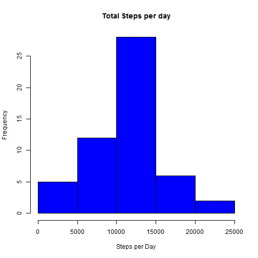
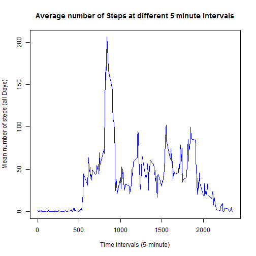
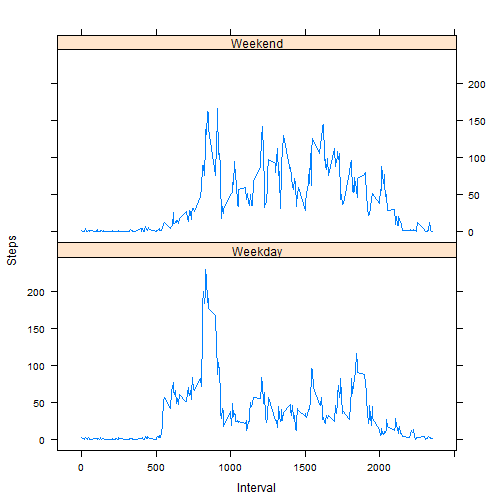

# COURSERA - Reproducible Research - Peer Assessment 1


```r
library(lattice)
```


## Loading and preprocessing the data
Load activity.csv  
Convert dates to R Date class

```r
activity <- read.csv("activity.csv")
activity$date <- as.Date(activity$date, "%Y-%m-%d")
```


## What is the mean total number of steps taken per day?
Computation of the total number of steps per day

```r
total_spd <- tapply(activity$steps, activity$date, sum)
```

Plotting of the histogram of total number of steps per day

```r
hist(total_spd, col = "blue", xlab = "Steps per Day", ylab = "Frequency", main = "Total Steps per day")
```

 


Computing the Mean of total steps per day

```r
mean(total_spd, na.rm = TRUE)
```

```
## [1] 10766
```


Computing the Median of  total steps per day

```r
median(total_spd, na.rm = TRUE)
```

```
## [1] 10765
```


## What is the average daily activity pattern?
Computing the mean of steps over all days by time interval

```r
mean_sbi <- tapply(activity$steps, activity$interval, mean, na.rm = TRUE)
```

Timeseries plot of of the 5-minute interval and the average number of steps taken, averaged across all days

```r
plot(row.names(mean_sbi), mean_sbi, type = "l", xlab = "Time Intervals (5-minute)", 
    ylab = "Mean number of steps (all Days)", main = "Average number of Steps at different 5 minute Intervals", 
    col = "blue")
```

 

Time interval containing the maximum average number of steps over all days

```r
interval_num <- which.max(mean_sbi)
interval_mas <- names(interval_num)
interval_mas
```

```
## [1] "835"
```

## Imputing missing values
Computing the number of NA values in the initial data

```r
number_nav <- sum(is.na(activity))
number_nav
```

```
## [1] 2304
```


Replacing missing values with the average interval value across all days

```r
na_indices <- which(is.na(activity))
replaced_values <- mean_sbi[as.character(activity[na_indices, 3])]
names(replaced_values) <- na_indices
for (i in na_indices) {
    activity$steps[i] = replaced_values[as.character(i)]
}
sum(is.na(activity))  # Checking that == 0
```

```
## [1] 0
```


## Are there differences in activity patterns between weekdays and weekends?


```r
days <- weekdays(activity$date)
activity$day_type <- ifelse(days == "Saturday" | days == "Sunday", "Weekend", 
    "Weekday")
mean_sbi <- aggregate(activity$steps, by = list(activity$interval, activity$day_type), 
    mean)
names(mean_sbi) <- c("interval", "day_type", "steps")
xyplot(steps ~ interval | day_type, mean_sbi, type = "l", layout = c(1, 2), 
    xlab = "Interval", ylab = "Steps")
```

 

Computing mean, median, max and min of the steps across all intervals and days by Weekdays and Weekends

```r
tapply(mean_sbi$steps, mean_sbi$day_type, function(x) {
    c(MIN = min(x), MEAN = mean(x), MEDIAN = median(x), MAX = max(x))
})
```

```
## $Weekday
##    MIN   MEAN MEDIAN    MAX 
##   0.00  35.61  25.80 230.38 
## 
## $Weekend
##    MIN   MEAN MEDIAN    MAX 
##   0.00  42.37  32.34 166.64
```

